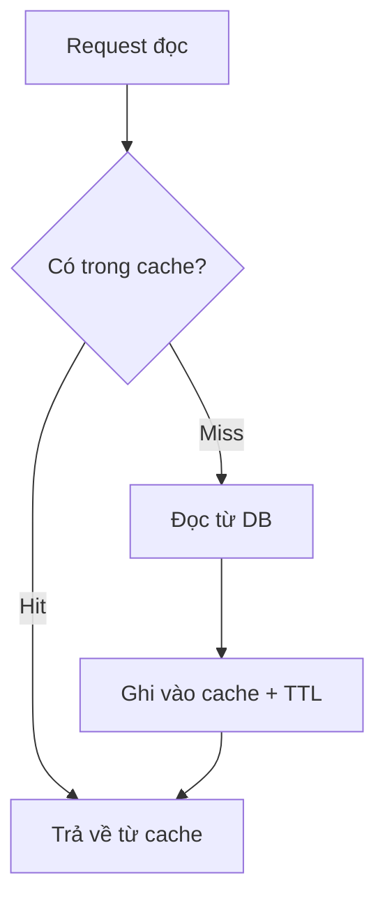

Thêm cache vào backend thường bắt đầu vui và kết thúc bằng một bug stale-data khó chịu lúc 2 giờ sáng. Lần đầu mình thêm Redis vào một API đọc nhiều, mọi thứ chạy mượt — cho đến khi người dùng phản ánh họ thấy dữ liệu cũ sau khi cập nhật hồ sơ. Vấn đề không phải "cache chậm" mà là **chọn sai pattern** cho tình huống. Bài này so sánh 3 pattern phổ biến nhất và cho bạn một cây quyết định để chọn nhanh.

**TL;DR**

- **Cache-aside**: mặc định tốt cho hầu hết app đọc nhiều. Đơn giản, ít rủi ro. Bắt đầu ở đây.
- **Write-through**: khi cần đọc-ngay-sau-ghi luôn thấy dữ liệu mới, chấp nhận ghi chậm hơn.
- **Write-behind (write-back)**: khi cần ghi cực nhanh và chấp nhận rủi ro mất dữ liệu — chỉ cho dữ liệu không quan trọng.

## 3 pattern khác nhau ở đâu

Ba pattern khác nhau ở hai câu hỏi: **ai nói chuyện với database** (code của bạn hay lớp cache), và **khi nào ghi xuống database** (ngay hay để sau). Cách phân trục này theo [tài liệu Redis](https://redis.io/docs/latest/develop/use-cases/cache-aside/) và các phân tích pattern gần đây.

### Cache-aside (lazy loading)

Ứng dụng kiểm cache trước. Trúng thì trả về; trượt thì đọc từ DB, ghi lại vào cache rồi trả về. Đây là pattern phổ biến nhất và thường là lựa chọn mặc định cho app đọc nhiều.

```go
func GetUser(ctx context.Context, id string) (*User, error) {
    key := "cache:user:" + id
    // 1. Thử đọc từ cache
    if data, err := rdb.Get(ctx, key).Result(); err == nil {
        return decodeUser(data) // decodeUser: hàm serialize bạn tự cài đặt
    }
    // 2. Cache miss -> đọc từ DB (nguồn sự thật)
    u, err := db.FindUser(ctx, id)
    if err != nil {
        return nil, err
    }
    // 3. Ghi lại cache kèm TTL để giới hạn thời gian dữ liệu có thể cũ
    rdb.Set(ctx, key, encodeUser(u), 10*time.Minute) // encodeUser: tự cài đặt
    return u, nil
}
```

> **Lưu ý:** TTL ở đây là "khoảng thời gian bạn chấp nhận sai". Diễn giải này lấy từ [Redis blog về cache consistency](https://redis.io/blog/cache-consistency-strategies/): mọi chiến lược nhất quán thực chất là thu hẹp khoảng lệch giữa cache và DB.

Luồng cache-aside cho một request đọc:



### Write-through

Mọi lần ghi đi qua cache: cập nhật cache **và** DB trong cùng thao tác ghi. Đọc ngay sau ghi luôn trúng cache với dữ liệu mới. Đổi lại, ghi chậm hơn vì phải chạm cả hai nơi.

```go
func UpdateUser(ctx context.Context, u *User) error {
    // 1. Ghi xuống DB (nguồn sự thật) trước
    if err := db.SaveUser(ctx, u); err != nil {
        return err
    }
    // 2. Cập nhật cache ngay trong cùng thao tác ghi
    //    -> đọc ngay sau ghi sẽ thấy dữ liệu mới
    key := "cache:user:" + u.ID
    return rdb.Set(ctx, key, encodeUser(u), 10*time.Minute).Err()
}
```

### Write-behind (write-back)

Ghi vào cache trước, trả về ngay, rồi **ghi xuống DB sau** (bất đồng bộ, gộp batch). Cho độ trễ ghi thấp nhất và throughput cao nhất, nhưng nếu cache sập trước khi flush thì **mất dữ liệu**. Theo các phân tích pattern, đây là lựa chọn rủi ro cao — chỉ nên dùng cho dữ liệu không quan trọng như session hay telemetry.

## Bảng so sánh

| Tiêu chí | Cache-aside | Write-through | Write-behind |
| --- | --- | --- | --- |
| Ai ghi xuống DB | Code ứng dụng | Lớp cache/code, đồng bộ | Lớp cache, bất đồng bộ |
| Độ trễ ghi | Bình thường | Cao hơn (ghi 2 nơi) | Thấp nhất |
| Rủi ro mất dữ liệu | Thấp | Thấp | Cao (nếu cache sập trước flush) |
| Đọc-ngay-sau-ghi | Có thể trượt | Luôn trúng, mới | Trúng, mới |
| Độ phức tạp | Thấp | Trung bình | Cao |
| Hợp nhất cho | App đọc nhiều (mặc định) | Cần đọc nhất quán sau ghi | Ghi rất nhiều, dữ liệu không quan trọng |

*(Các đặc tính trong bảng tổng hợp từ tài liệu Redis và các phân tích pattern 2026 dẫn ở mục Nguồn; không phải số benchmark đo được.)*

## Chọn pattern nào? (cây quyết định)

1. **App của bạn đọc nhiều, ghi vừa phải?** → Bắt đầu với **cache-aside**. Đây là mặc định ít rủi ro nhất.
2. **Đọc ngay sau ghi phải thấy dữ liệu mới ngay?** → Cân nhắc **write-through**.
3. **Ghi cực nhiều, chấp nhận mất một ít dữ liệu khi sự cố?** → **Write-behind**, chỉ cho dữ liệu không quan trọng.

## Đừng quên: cache invalidation

Chọn pattern mới là một nửa. Nửa còn lại là giữ cache không bị cũ. Redis **không tự biết** DB thay đổi — ứng dụng, TTL, hoặc CDC phải lo việc đó (diễn giải từ [Redis blog](https://redis.io/blog/cache-consistency-strategies/)). Hai cách phổ biến:

- **TTL**: đơn giản, chấp nhận cũ trong khoảng TTL.
- **Invalidation chủ động trên đường ghi**: xóa/cập nhật key ngay khi dữ liệu đổi — dùng khi không chấp nhận cũ.

Đây chính là gốc của bug stale-data mình gặp ở đầu bài: dùng cache-aside với TTL 10 phút nhưng không invalidate khi user cập nhật hồ sơ, nên trong tối đa 10 phút họ vẫn thấy dữ liệu cũ. Cách sửa: xóa key ngay trong đường ghi.

## Key takeaways

- Không có pattern "tốt nhất"; có pattern hợp với tỉ lệ đọc/ghi và mức chấp nhận cũ của bạn.
- Cache-aside là điểm khởi đầu an toàn cho phần lớn app đọc nhiều.
- Write-behind nhanh nhưng đánh đổi độ bền — tránh cho dữ liệu quan trọng.
- Luôn thiết kế invalidation cùng lúc với pattern, không để sau.

## Nguồn tham khảo

- [Redis — Cache-aside](https://redis.io/docs/latest/develop/use-cases/cache-aside/)
- [Redis — Cache consistency strategies](https://redis.io/blog/cache-consistency-strategies/)
- [Redis — Cache eviction strategies](https://redis.io/blog/cache-eviction-strategies/)

<!-- Internal link khi xuất bản: trỏ về pillar "Caching trong backend" và bài chi tiết "Redis cache invalidation". -->
