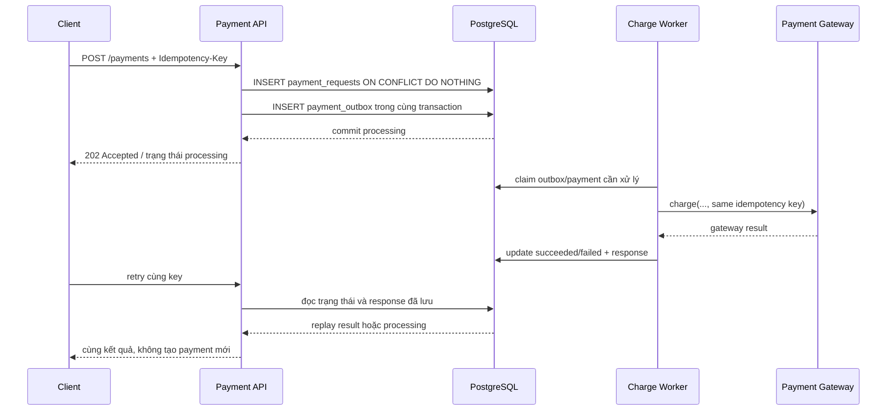

# Chống double-charge bằng idempotency key và PostgreSQL

Một client gọi `POST /payments`, chờ quá lâu rồi retry. Request đầu tiên có thể đã tới payment service và gateway nhưng response bị mất trên đường về. Nếu server coi lần retry là lệnh mới, cùng một đơn hàng có thể bị trừ tiền hai lần.

`Idempotency-Key` giải quyết phần nhận diện: nhiều lần gửi cùng một key là cùng một ý định nghiệp vụ. PostgreSQL cung cấp hàng rào bền vững bằng unique constraint và `INSERT ... ON CONFLICT`. Nhưng database không tự làm cho một lời gọi HTTP tới gateway bên ngoài trở thành transaction nguyên tử. Muốn chống double-charge thật sự, cần phối hợp với idempotency contract của payment provider hoặc một quy trình outbox/reconciliation rõ ràng.

**TL;DR**

- Lưu key cùng fingerprint của request và đặt `UNIQUE`; không dùng mẫu check-then-insert vì hai request có thể cùng thấy “chưa có”.
- Request thắng cuộc tạo payment ở trạng thái `processing` và outbox trong cùng transaction; worker mới gọi gateway.
- Retry với cùng payload thì đọc kết quả cũ hoặc nhận trạng thái đang xử lý; cùng key nhưng payload khác phải bị từ chối.
- Dùng cùng key ở gateway nếu provider hỗ trợ. PostgreSQL alone không chứng minh được external charge không lặp sau crash.

## 1. Xác định contract của idempotency key

Client tạo một key ngẫu nhiên cho **một logical payment attempt** và gửi lại chính key đó khi retry do timeout hoặc lỗi mạng. Một payment mới phải có key mới.

Server cần lưu ít nhất:

- `idempotency_key`: định danh retry;
- `request_hash`: fingerprint của các trường ảnh hưởng tới charge, ví dụ order, amount và currency;
- trạng thái và response đã chốt;
- payment ID và gateway ID nếu đã có;
- thời điểm tạo để phục vụ retention/reconciliation.

Nếu key cũ được gửi với `amount_cents` khác, server không được âm thầm trả kết quả của request cũ. Đó là lỗi dùng key sai và nên trả `409 Conflict` hoặc lỗi tương đương trong contract của API.

Stripe mô tả một cách triển khai trong đó server lưu status code và body của request đầu tiên, sau đó trả lại kết quả cho các request dùng cùng key; họ cũng so sánh parameter của request mới với request cũ. Đây là ví dụ về contract của một provider, không phải quy tắc bắt buộc cho mọi gateway. [Stripe — Idempotent requests](https://docs.stripe.com/api/idempotent_requests)

## 2. Schema PostgreSQL

Đoạn SQL dưới đây chạy trên PostgreSQL có hỗ trợ identity columns và `jsonb`. Không cần extension. `payment_requests` vừa là bảng idempotency vừa giữ state của payment; `payment_outbox` bảo đảm việc phát lệnh charge không bị mất giữa lúc API commit và worker chạy.

```sql
CREATE TABLE payment_requests (
    id                bigint GENERATED ALWAYS AS IDENTITY PRIMARY KEY,
    idempotency_key   text NOT NULL UNIQUE,
    request_hash      text NOT NULL,
    merchant_order_id text NOT NULL UNIQUE,
    amount_cents      bigint NOT NULL CHECK (amount_cents > 0),
    currency          text NOT NULL CHECK (
        currency = upper(currency) AND char_length(currency) = 3
    ),
    status            text NOT NULL CHECK (
        status IN ('processing', 'succeeded', 'failed')
    ),
    gateway_payment_id text,
    response_status   integer,
    response_body     jsonb,
    created_at        timestamptz NOT NULL DEFAULT now(),
    updated_at        timestamptz NOT NULL DEFAULT now()
);

CREATE TABLE payment_outbox (
    id                 bigint GENERATED ALWAYS AS IDENTITY PRIMARY KEY,
    payment_request_id bigint NOT NULL REFERENCES payment_requests(id),
    event_type         text NOT NULL CHECK (event_type = 'charge_payment'),
    payload            jsonb NOT NULL,
    created_at         timestamptz NOT NULL DEFAULT now(),
    published_at       timestamptz,
    UNIQUE (payment_request_id, event_type)
);

CREATE INDEX payment_requests_processing_idx
    ON payment_requests (status, created_at)
    WHERE status = 'processing';
```

Unique constraints buộc dữ liệu không có hai dòng cùng key; PostgreSQL ghi rõ constraint vi phạm sẽ tạo lỗi. `ON CONFLICT` cho phép chọn hành động thay thế khi insert đụng unique hoặc exclusion constraint. [PostgreSQL — Constraints](https://www.postgresql.org/docs/current/ddl-constraints.html) và [PostgreSQL — INSERT](https://www.postgresql.org/docs/current/sql-insert.html)

`updated_at` trong ví dụ cần được cập nhật bởi application hoặc trigger khi state đổi. Bài không đưa trigger để giữ phần minh họa ngắn; production nên chọn một cách duy nhất và test nó.

## 3. Luồng request và worker



Sơ đồ tách transaction database khỏi network call. Không nên giữ transaction mở trong lúc chờ gateway nếu bạn không có lý do rất rõ: thời gian giữ lock dài hơn, connection bị chiếm lâu hơn và lỗi mạng khó xử lý hơn.

## 4. Insert nguyên tử thay cho check-then-insert

Mẫu nguy hiểm là:

```text
SELECT ... WHERE idempotency_key = $1
Nếu chưa có: gọi charge rồi INSERT
```

Hai instance có thể cùng chạy `SELECT`, cùng thấy chưa có và cùng gọi gateway trước khi instance nào ghi marker. Unique constraint ở bước sau không hoàn tác side effect đã xảy ra.

Thay vào đó, transaction đầu tiên phải giành quyền tạo request bằng một statement có conflict handling. Đây là phần repository minh họa bằng Go `database/sql` và driver PostgreSQL tương thích với `database/sql`; import driver và version cần được pin trong `go.mod` của service thật. Giới hạn 255 ký tự trong hàm `validate` là policy minh họa của API này, không phải giới hạn chung của mọi payment provider; contract thật phải lấy từ provider và client của bạn.

```go
package payment

import (
    "context"
    "crypto/sha256"
    "database/sql"
    "encoding/hex"
    "encoding/json"
    "errors"
    "fmt"
    "strings"
)

type PaymentInput struct {
    MerchantOrderID string `json:"merchant_order_id"`
    AmountCents     int64  `json:"amount_cents"`
    Currency        string `json:"currency"`
}

type AcceptedPayment struct {
    ID             int64
    Status         string
    ResponseStatus int
    ResponseBody   []byte
}

type InProgressError struct{}

func (InProgressError) Error() string { return "payment is already processing" }

type KeyPayloadMismatchError struct{}

func (KeyPayloadMismatchError) Error() string {
    return "idempotency key was reused with a different payload"
}

func requestHash(input PaymentInput) (string, error) {
    canonical, err := json.Marshal(input)
    if err != nil {
        return "", fmt.Errorf("marshal payment input: %w", err)
    }
    digest := sha256.Sum256(canonical)
    return hex.EncodeToString(digest[:]), nil
}

func validate(input PaymentInput, key string) error {
    if strings.TrimSpace(key) == "" || len(key) > 255 {
        return errors.New("idempotency key must contain 1 to 255 characters")
    }
    if input.AmountCents <= 0 {
        return errors.New("amount_cents must be positive")
    }
    if len(input.Currency) != 3 || input.Currency != strings.ToUpper(input.Currency) {
        return errors.New("currency must be a three-letter uppercase code")
    }
    if strings.TrimSpace(input.MerchantOrderID) == "" {
        return errors.New("merchant_order_id is required")
    }
    return nil
}

// BeginPayment reserves a logical payment. It deliberately does not call
// the external gateway while the database transaction is open.
func BeginPayment(ctx context.Context, db *sql.DB, key string, input PaymentInput) (AcceptedPayment, error) {
    if err := validate(input, key); err != nil {
        return AcceptedPayment{}, err
    }

    hash, err := requestHash(input)
    if err != nil {
        return AcceptedPayment{}, err
    }

    tx, err := db.BeginTx(ctx, nil)
    if err != nil {
        return AcceptedPayment{}, fmt.Errorf("begin transaction: %w", err)
    }
    defer tx.Rollback() // harmless after a successful commit

    var paymentID int64
    insertErr := tx.QueryRowContext(ctx, `
        INSERT INTO payment_requests (
            idempotency_key, request_hash, merchant_order_id,
            amount_cents, currency, status
        )
        VALUES ($1, $2, $3, $4, $5, 'processing')
        ON CONFLICT (idempotency_key) DO NOTHING
        RETURNING id
    `, key, hash, input.MerchantOrderID, input.AmountCents, input.Currency).Scan(&paymentID)

    if errors.Is(insertErr, sql.ErrNoRows) {
        var paymentID int64
        var storedHash, status string
        var responseStatus sql.NullInt64
        var responseBody []byte
        err = tx.QueryRowContext(ctx, `
            SELECT id, request_hash, status, response_status, response_body
            FROM payment_requests
            WHERE idempotency_key = $1
        `, key).Scan(&paymentID, &storedHash, &status, &responseStatus, &responseBody)
        if err != nil {
            return AcceptedPayment{}, fmt.Errorf("read existing payment: %w", err)
        }
        if storedHash != hash {
            return AcceptedPayment{}, KeyPayloadMismatchError{}
        }
        if status == "processing" {
            return AcceptedPayment{}, InProgressError{}
        }

        if err := tx.Commit(); err != nil {
            return AcceptedPayment{}, fmt.Errorf("commit replay: %w", err)
        }
        return AcceptedPayment{
            ID:             paymentID,
            Status:         status,
            ResponseStatus: int(responseStatus.Int64),
            ResponseBody:   responseBody,
        }, nil
    }
    if insertErr != nil {
        return AcceptedPayment{}, fmt.Errorf("reserve payment: %w", insertErr)
    }

    payload, err := json.Marshal(map[string]any{
        "payment_request_id": paymentID,
        "idempotency_key":     key,
    })
    if err != nil {
        return AcceptedPayment{}, fmt.Errorf("marshal outbox payload: %w", err)
    }

    if _, err := tx.ExecContext(ctx, `
        INSERT INTO payment_outbox (payment_request_id, event_type, payload)
        VALUES ($1, 'charge_payment', $2::jsonb)
    `, paymentID, string(payload)); err != nil {
        return AcceptedPayment{}, fmt.Errorf("create outbox event: %w", err)
    }

    if err := tx.Commit(); err != nil {
        return AcceptedPayment{}, fmt.Errorf("commit payment reservation: %w", err)
    }
    return AcceptedPayment{ID: paymentID, Status: "processing"}, nil
}
```

Trong code, `ON CONFLICT (idempotency_key) DO NOTHING RETURNING id` có hai kết quả: request thắng nhận một `id` để tạo outbox; request retry không nhận dòng mới và đọc state đã lưu. `merchant_order_id` cũng có unique constraint để bảo vệ invariant nghiệp vụ nếu client vô tình tạo key mới cho cùng order.

Ở endpoint thật, map lỗi như sau: payload khác key cũ là `409`; payment đang xử lý có thể là `202` kèm endpoint polling; trạng thái đã chốt thì trả đúng `response_status` và `response_body` đã lưu. Đừng trả kết quả của một request khác chỉ vì cùng `merchant_order_id` nếu contract chưa quy định điều đó.

## 5. Worker phải dùng idempotency của gateway

Worker đọc outbox, gọi provider và truyền **cùng logical key**. Interface tối giản:

```go
type GatewayCharge struct {
    MerchantOrderID string
    AmountCents     int64
    Currency        string
}

type GatewayResult struct {
    PaymentID string
    Status    string // succeeded hoặc failed theo contract của gateway
    Body      []byte
}

type Gateway interface {
    Charge(ctx context.Context, request GatewayCharge, idempotencyKey string) (GatewayResult, error)
}
```

Worker cần có lease/claim an toàn, timeout, retry có backoff và cập nhật state bằng transaction. Khi gọi lại sau crash, gateway phải nhận cùng key hoặc worker phải có reconciliation với gateway trước khi gửi lệnh mới. Nếu provider chỉ có một API “charge” không có idempotency, database không thể biết chắc request đã tới provider nhưng response đã mất.

Đây là ranh giới quan trọng:

- **PostgreSQL unique constraint** ngăn hai dòng đại diện cho cùng key trong database.
- **Outbox** giúp không mất ý định charge sau khi API commit.
- **Gateway idempotency/reconciliation** ngăn side effect tiền bị lặp khi worker crash quanh network call.

Không nên mô tả ba lớp này như một transaction phân tán duy nhất. Chúng là các hàng rào ở các boundary khác nhau.

## 6. Xử lý cạnh tranh và trạng thái đang xử lý

PostgreSQL nói rằng bảng có unique index có thể phải chờ khi các session concurrent cùng chèn giá trị xung đột; `ON CONFLICT` xác định hành động sau khi conflict được xử lý. [PostgreSQL — INSERT](https://www.postgresql.org/docs/current/sql-insert.html)

Vì vậy retry đồng thời không nhất thiết trả về ngay. Đây là hành vi cần tính vào timeout và UX:

- request đầu tiên commit `processing` rồi trả `202`;
- retry sau đó đọc `processing` và poll hoặc nhận `Retry-After`;
- worker chốt `succeeded`/`failed` cùng response;
- mọi retry sau đó replay state đã chốt.

Đừng giữ một transaction mở để chờ gateway chỉ nhằm làm request thứ hai “đợi lock”. Cách đó biến lock database thành hàng đợi network và có thể làm cạn connection pool.

## 7. Retention, fingerprint và response replay

Idempotency record không thể xóa tùy ý. Khoảng retention phải dài hơn cửa sổ retry của client, thời gian retry của worker và thời gian reconciliation với gateway. Nếu xóa key rồi nhận lại key cũ, server có thể coi đó là payment mới.

Một policy thực tế cần trả lời:

- key hết hạn sau bao lâu;
- record đã `succeeded` lưu response bao lâu;
- dữ liệu nào được mã hóa hoặc redacted;
- có cho client truy vấn trạng thái bằng key không;
- cleanup chạy thế nào mà không xóa payment còn đang xử lý.

Không lưu card number, CVV hay secret vào `request_hash`, payload outbox hoặc response. Fingerprint chỉ nên chứa các trường cần để phát hiện reuse sai; dữ liệu nhạy cảm phải tuân theo PCI và policy của hệ thống thanh toán.

## Khi nào không nên dùng cách này?

Idempotency key hữu ích cho command có side effect và có thể bị retry, nhưng không phải middleware bắt buộc cho mọi endpoint.

- Không cần thêm key cho `GET` thuần đọc nếu endpoint đã không tạo side effect; thiết kế resource vẫn phải đúng semantics.
- Không dùng cùng một key cho hai nghiệp vụ cố ý khác nhau, chẳng hạn hai lần thanh toán hai order.
- Không coi bảng PostgreSQL là đủ nếu side effect nằm ở provider không có idempotency và không có reconciliation.
- Không giữ record vô thời hạn mà không tính chi phí storage, privacy và cleanup.
- Nếu hệ thống xử lý event có deduplication tự nhiên bằng event ID, hãy so sánh với cơ chế đó thay vì tạo thêm một lớp key trùng nghĩa.

## Key takeaways

- Idempotency key là identity của logical command, không phải mã đơn hàng và cũng không phải authorization token.
- `UNIQUE` + `INSERT ... ON CONFLICT` tạo điểm tranh quyền nguyên tử trong PostgreSQL; check-then-insert không đủ an toàn.
- Lưu reservation và outbox trong cùng transaction, nhưng không gọi gateway trong transaction đó.
- Muốn chống double-charge qua crash boundary, cần idempotency key ở gateway hoặc reconciliation; không được hứa hẹn nhiều hơn contract thực tế.

## Nguồn tham khảo

- [PostgreSQL — Constraints](https://www.postgresql.org/docs/current/ddl-constraints.html)
- [PostgreSQL — INSERT / ON CONFLICT](https://www.postgresql.org/docs/current/sql-insert.html)
- [PostgreSQL — Transaction Isolation](https://www.postgresql.org/docs/current/transaction-iso.html)
- [Stripe — Idempotent requests](https://docs.stripe.com/api/idempotent_requests)

---

*Meta description (150–160 ký tự):* Thiết kế payment API chống double-charge bằng idempotency key và PostgreSQL: unique constraint, outbox, worker retry, replay response và trade-off thực tế.
