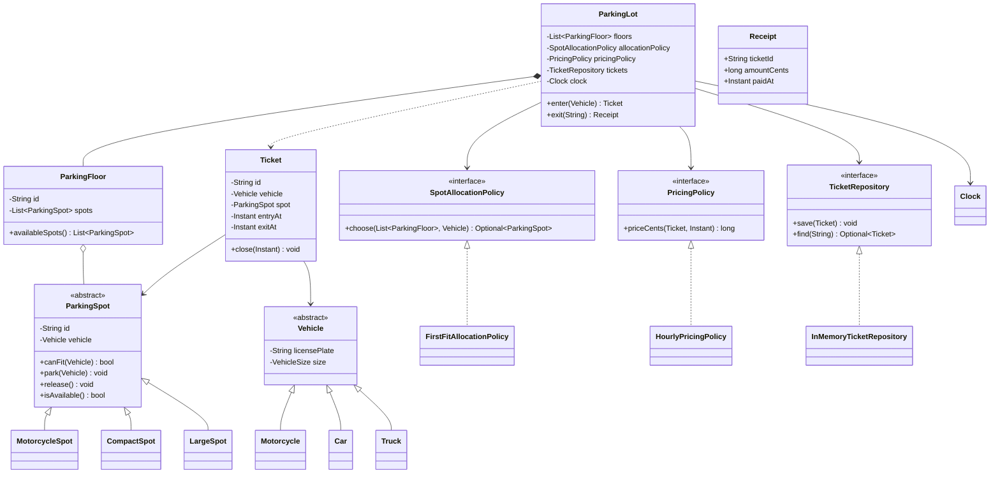

# Thiết kế bãi đỗ xe bằng OOP

Parking lot là bài LLD quen thuộc vì nó có đủ entity, trạng thái, rule tương thích và chính sách có thể thay đổi. Một thiết kế tốt không bắt đầu bằng việc nhồi thật nhiều design pattern; nó bắt đầu bằng câu hỏi: hệ thống phải làm gì, invariant nào không được phá vỡ và phần nào có khả năng thay đổi?

Bài này xây một mô hình trong memory cho bãi đỗ xe nhiều tầng. Phần domain không xử lý HTTP, database hay payment gateway. Mục tiêu là thể hiện cách chia trách nhiệm, một class diagram khớp code và các điểm mở rộng có thể kiểm thử.

**TL;DR**

- `ParkingLot` điều phối; `ParkingFloor` quản lý spot; `Ticket` giữ phiên đỗ; policy tách khỏi entity.
- Dùng Strategy cho allocation và pricing vì hai rule này có thể thay đổi độc lập; không thêm Factory chỉ để có thêm pattern.
- Interface nhỏ giúp test policy/repository/clock bằng fake; code dưới đây là một file Java 17 có thể chạy.
- Bài kiểm tra mở rộng tập trung vào xe mới, pricing mới, allocation mới và invariant không overbook.

## 1. Requirements trước khi thiết kế class

### Functional requirements

Hệ thống cần hỗ trợ:

1. Bãi đỗ có nhiều `ParkingFloor`.
2. Mỗi floor có nhiều spot; spot chỉ giữ tối đa một vehicle.
3. Xe vào bãi nếu có spot tương thích, nhận `Ticket` chứa ticket ID, vehicle, spot và thời điểm vào.
4. Xe ra bằng ticket ID; hệ thống tính phí, đóng ticket và giải phóng spot.
5. Hỗ trợ tối thiểu `Motorcycle`, `Car`, `Truck` và các spot `MotorcycleSpot`, `CompactSpot`, `LargeSpot`.
6. Có thể thay allocation policy và pricing policy mà không sửa luồng điều phối chính.

### Non-functional requirements và invariant

- Không được assign một spot đang bận.
- Không được close một ticket hai lần.
- Không được tính phí cho thời điểm ra trước thời điểm vào.
- Rule nghiệp vụ có thể unit test mà không cần database hoặc đồng hồ hệ thống thật.
- Không yêu cầu xử lý thanh toán thật, authentication, biển báo điện tử hay distributed locking trong bài này.

Giới hạn phạm vi là một phần của thiết kế. Nếu thêm online reservation hoặc nhiều instance ghi cùng một bãi, model in-memory này cần một lớp persistence và concurrency control khác.

## 2. Use cases chính

### Xe vào

1. Validate vehicle.
2. Allocation policy tìm spot trống tương thích.
3. Spot chuyển sang occupied.
4. Tạo và lưu ticket.
5. Trả ticket cho caller.

### Xe ra

1. Tìm ticket theo ID.
2. Từ chối nếu ticket đã đóng hoặc không tồn tại.
3. Pricing policy tính phí tại thời điểm ra.
4. Đóng ticket và release spot.
5. Trả receipt.

Từ use case này có thể thấy `ParkingLot` không nên tự biết từng công thức phí hay tự quét mọi spot bằng một đống `if/else`. Nó điều phối các abstraction có trách nhiệm rõ hơn.

## 3. Class diagram



`ParkingLot *-- ParkingFloor` thể hiện lot sở hữu danh sách floor trong model này. `ParkingFloor o-- ParkingSpot` dùng aggregation vì floor quản lý các spot nhưng lifecycle persistence có thể được tách ra ở hệ thống thật. `SpotAllocationPolicy` và `PricingPolicy` là Strategy: chúng mô tả hành vi có thể thay đổi, không phải entity trong domain.

## 4. Design pattern: dùng vì vấn đề, không dùng vì danh sách

### Strategy cho allocation

First-fit là rule đơn giản hôm nay. Ngày mai có thể cần “ưu tiên floor gần cổng”, “ưu tiên spot nhỏ nhất” hoặc phân bổ theo reservation. Nếu nhét tất cả vào `ParkingLot`, class điều phối sẽ phình to. `SpotAllocationPolicy` cho phép thay thuật toán mà không đổi use case `enter`.

### Strategy cho pricing

Hourly pricing chỉ là một chính sách. Có thể thêm pricing theo ngày, theo membership hoặc theo giờ cao điểm. `PricingPolicy` tách thay đổi này khỏi `exit`.

### Vì sao không dùng Factory ở đây?

Trong phạm vi nhỏ, caller có thể tạo `Car`, `CompactSpot` hoặc policy trực tiếp. Thêm Factory chỉ để minh họa Factory sẽ tạo thêm abstraction nhưng chưa giải quyết yêu cầu nào. Khi dữ liệu xe đến từ một payload hoặc cấu hình runtime, một factory/registry có thể trở nên hợp lý; pattern chỉ nên xuất hiện khi có vấn đề construction thật.

## 5. Code Java chạy được

Đoạn dưới đây là file `ParkingLotDemo.java`, dùng Java 17 và chỉ dùng standard library. Các class phụ để package-private trong cùng file nên có thể copy nguyên khối, lưu đúng tên file rồi chạy:

```java
import java.time.Clock;
import java.time.Duration;
import java.time.Instant;
import java.util.List;
import java.util.Map;
import java.util.Optional;
import java.util.UUID;
import java.util.concurrent.ConcurrentHashMap;

public class ParkingLotDemo {
    public static void main(String[] args) {
        ParkingFloor floor = new ParkingFloor("F1", List.of(
                new CompactSpot("C-1"),
                new LargeSpot("L-1"),
                new MotorcycleSpot("M-1")
        ));

        ParkingLot lot = new ParkingLot(
                List.of(floor),
                new FirstFitAllocationPolicy(),
                new HourlyPricingPolicy(300, 500, 800),
                new InMemoryTicketRepository(),
                Clock.systemUTC()
        );

        Ticket ticket = lot.enter(new Car("CAR-001"));
        Receipt receipt = lot.exit(ticket.id());

        System.out.println(ticket.spot().id());
        System.out.println(receipt.amountCents() + " cents");
    }
}

enum VehicleSize {
    MOTORCYCLE, CAR, TRUCK
}

abstract class Vehicle {
    private final String licensePlate;
    private final VehicleSize size;

    protected Vehicle(String licensePlate, VehicleSize size) {
        if (licensePlate == null || licensePlate.isBlank()) {
            throw new IllegalArgumentException("license plate is required");
        }
        this.licensePlate = licensePlate;
        this.size = size;
    }

    public String licensePlate() {
        return licensePlate;
    }

    public VehicleSize size() {
        return size;
    }
}

final class Motorcycle extends Vehicle {
    Motorcycle(String licensePlate) {
        super(licensePlate, VehicleSize.MOTORCYCLE);
    }
}

final class Car extends Vehicle {
    Car(String licensePlate) {
        super(licensePlate, VehicleSize.CAR);
    }
}

final class Truck extends Vehicle {
    Truck(String licensePlate) {
        super(licensePlate, VehicleSize.TRUCK);
    }
}

abstract class ParkingSpot {
    private final String id;
    private Vehicle vehicle;

    protected ParkingSpot(String id) {
        if (id == null || id.isBlank()) {
            throw new IllegalArgumentException("spot id is required");
        }
        this.id = id;
    }

    public String id() {
        return id;
    }

    public boolean isAvailable() {
        return vehicle == null;
    }

    public Vehicle vehicle() {
        return vehicle;
    }

    public abstract boolean canFit(Vehicle candidate);

    public void park(Vehicle candidate) {
        if (!isAvailable()) {
            throw new IllegalStateException("spot is occupied");
        }
        if (!canFit(candidate)) {
            throw new IllegalArgumentException("vehicle does not fit");
        }
        vehicle = candidate;
    }

    public void release() {
        if (isAvailable()) {
            throw new IllegalStateException("spot is already empty");
        }
        vehicle = null;
    }
}

final class MotorcycleSpot extends ParkingSpot {
    MotorcycleSpot(String id) {
        super(id);
    }

    @Override
    public boolean canFit(Vehicle vehicle) {
        return vehicle.size() == VehicleSize.MOTORCYCLE;
    }
}

final class CompactSpot extends ParkingSpot {
    CompactSpot(String id) {
        super(id);
    }

    @Override
    public boolean canFit(Vehicle vehicle) {
        return vehicle.size() == VehicleSize.MOTORCYCLE
                || vehicle.size() == VehicleSize.CAR;
    }
}

final class LargeSpot extends ParkingSpot {
    LargeSpot(String id) {
        super(id);
    }

    @Override
    public boolean canFit(Vehicle vehicle) {
        return true;
    }
}

final class ParkingFloor {
    private final String id;
    private final List<ParkingSpot> spots;

    ParkingFloor(String id, List<ParkingSpot> spots) {
        if (id == null || id.isBlank() || spots == null || spots.isEmpty()) {
            throw new IllegalArgumentException("floor id and spots are required");
        }
        this.id = id;
        this.spots = List.copyOf(spots);
    }

    public String id() {
        return id;
    }

    public List<ParkingSpot> availableSpots() {
        return spots.stream().filter(ParkingSpot::isAvailable).toList();
    }
}

interface SpotAllocationPolicy {
    Optional<ParkingSpot> choose(List<ParkingFloor> floors, Vehicle vehicle);
}

final class FirstFitAllocationPolicy implements SpotAllocationPolicy {
    @Override
    public Optional<ParkingSpot> choose(List<ParkingFloor> floors, Vehicle vehicle) {
        return floors.stream()
                .flatMap(floor -> floor.availableSpots().stream())
                .filter(spot -> spot.canFit(vehicle))
                .findFirst();
    }
}

interface PricingPolicy {
    long priceCents(Ticket ticket, Instant exitAt);
}

final class HourlyPricingPolicy implements PricingPolicy {
    private final long motorcycleRate;
    private final long carRate;
    private final long truckRate;

    HourlyPricingPolicy(long motorcycleRate, long carRate, long truckRate) {
        this.motorcycleRate = positive(motorcycleRate);
        this.carRate = positive(carRate);
        this.truckRate = positive(truckRate);
    }

    @Override
    public long priceCents(Ticket ticket, Instant exitAt) {
        if (exitAt.isBefore(ticket.entryAt())) {
            throw new IllegalArgumentException("exit cannot be before entry");
        }
        long minutes = Duration.between(ticket.entryAt(), exitAt).toMinutes();
        long billableHours = Math.max(1, (minutes + 59) / 60);
        return Math.multiplyExact(billableHours, rateFor(ticket.vehicle().size()));
    }

    private long rateFor(VehicleSize size) {
        return switch (size) {
            case MOTORCYCLE -> motorcycleRate;
            case CAR -> carRate;
            case TRUCK -> truckRate;
        };
    }

    private static long positive(long value) {
        if (value <= 0) {
            throw new IllegalArgumentException("rate must be positive");
        }
        return value;
    }
}

final class Ticket {
    private final String id;
    private final Vehicle vehicle;
    private final ParkingSpot spot;
    private final Instant entryAt;
    private Instant exitAt;

    Ticket(String id, Vehicle vehicle, ParkingSpot spot, Instant entryAt) {
        this.id = id;
        this.vehicle = vehicle;
        this.spot = spot;
        this.entryAt = entryAt;
    }

    public String id() {
        return id;
    }

    public Vehicle vehicle() {
        return vehicle;
    }

    public ParkingSpot spot() {
        return spot;
    }

    public Instant entryAt() {
        return entryAt;
    }

    public boolean isOpen() {
        return exitAt == null;
    }

    public void close(Instant at) {
        if (!isOpen()) {
            throw new IllegalStateException("ticket is already closed");
        }
        if (at.isBefore(entryAt)) {
            throw new IllegalArgumentException("exit cannot be before entry");
        }
        exitAt = at;
    }
}

record Receipt(String ticketId, long amountCents, Instant paidAt) {}

interface TicketRepository {
    void save(Ticket ticket);
    Optional<Ticket> find(String ticketId);
}

final class InMemoryTicketRepository implements TicketRepository {
    private final Map<String, Ticket> tickets = new ConcurrentHashMap<>();

    @Override
    public void save(Ticket ticket) {
        tickets.put(ticket.id(), ticket);
    }

    @Override
    public Optional<Ticket> find(String ticketId) {
        return Optional.ofNullable(tickets.get(ticketId));
    }
}

final class ParkingLot {
    private final List<ParkingFloor> floors;
    private final SpotAllocationPolicy allocationPolicy;
    private final PricingPolicy pricingPolicy;
    private final TicketRepository tickets;
    private final Clock clock;

    ParkingLot(
            List<ParkingFloor> floors,
            SpotAllocationPolicy allocationPolicy,
            PricingPolicy pricingPolicy,
            TicketRepository tickets,
            Clock clock) {
        this.floors = List.copyOf(floors);
        this.allocationPolicy = allocationPolicy;
        this.pricingPolicy = pricingPolicy;
        this.tickets = tickets;
        this.clock = clock;
    }

    public Ticket enter(Vehicle vehicle) {
        if (vehicle == null) {
            throw new IllegalArgumentException("vehicle is required");
        }
        ParkingSpot spot = allocationPolicy.choose(floors, vehicle)
                .orElseThrow(() -> new IllegalStateException("no compatible spot"));
        spot.park(vehicle);

        Ticket ticket = new Ticket(
                UUID.randomUUID().toString(), vehicle, spot, clock.instant());
        tickets.save(ticket);
        return ticket;
    }

    public Receipt exit(String ticketId) {
        Ticket ticket = tickets.find(ticketId)
                .orElseThrow(() -> new IllegalArgumentException("ticket not found"));
        Instant exitAt = clock.instant();
        long amount = pricingPolicy.priceCents(ticket, exitAt);
        ticket.close(exitAt);
        ticket.spot().release();
        return new Receipt(ticket.id(), amount, exitAt);
    }
}
```

`ParkingLot` vẫn có một rủi ro đáng nói: nếu `tickets.save` là database call và fail sau `spot.park`, state có thể lệch. Trong model in-memory, repository không fail để code tập trung vào domain. Production cần transaction/persistence boundary hoặc cơ chế compensation; không nên coi đoạn demo là concurrency-safe cho nhiều process.

## 6. SOLID thể hiện ở đâu?

- **Single Responsibility:** `ParkingSpot` giữ occupancy, `ParkingFloor` quản lý tập spot, `PricingPolicy` tính phí, `TicketRepository` lưu ticket, còn `ParkingLot` điều phối use case.
- **Open/Closed:** thêm `WeekendPricingPolicy` hoặc `NearestGateAllocationPolicy` bằng implementation mới mà không sửa flow chính.
- **Liskov Substitution:** `MotorcycleSpot`, `CompactSpot` và `LargeSpot` đều phải giữ contract `park/release/canFit`; caller không cần biết concrete type để quản lý trạng thái.
- **Interface Segregation:** interface nhỏ, policy không bị buộc phải phụ thuộc repository; repository chỉ có `save/find` cho nhu cầu bài này.
- **Dependency Inversion:** `ParkingLot` nhận `Clock`, policy và repository từ constructor, nên test không phụ thuộc `Clock.systemUTC()` hay storage cụ thể.

SOLID không có nghĩa là tách mọi dòng code thành class riêng. Nếu một abstraction chưa có lý do thay đổi độc lập, tách nó có thể làm thiết kế khó đọc hơn.

## 7. Bài kiểm tra mở rộng thiết kế

### Scenario A: thêm ElectricCar

Tạo `ElectricCar extends Vehicle` nhưng dùng `VehicleSize.CAR`. `CompactSpot` và `LargeSpot` vẫn fit dựa trên size; pricing policy hiện tại cũng xử lý được. Đây là extension không cần sửa `ParkingLot`.

Nếu ElectricCar cần charging spot, hãy hỏi requirements mới: charging có phải một capability độc lập không? Khi đó có thể thêm `ChargingSpot` hoặc `ChargingCapability` thay vì biến `ParkingSpot` thành class biết toàn bộ loại xe.

### Scenario B: thêm cách tính phí theo ngày

Viết `DailyPricingPolicy implements PricingPolicy`, inject vào `ParkingLot` trong test. Không sửa `Ticket`, `ParkingFloor` hay method `exit`. Nếu phải thêm `if (pricingMode == DAILY)` vào `ParkingLot`, abstraction đang bị đặt sai.

### Scenario C: ưu tiên spot gần cổng

Thêm thứ tự hoặc distance vào `ParkingSpot`, viết `NearestGateAllocationPolicy`. Test phải chứng minh cùng input nhưng chọn spot khác `FirstFitAllocationPolicy`, trong khi invariant “spot phải trống và fit xe” vẫn giữ nguyên.

### Scenario D: hai request cùng lúc

Hai thread cùng gọi `enter` khi chỉ còn một spot. Model in-memory hiện chưa tuyên bố là thread-safe: `choose` và `park` không phải một thao tác nguyên tử. Đây là câu hỏi mở rộng quan trọng. Có thể giải quyết bằng lock theo lot/spot, transaction ở persistence layer hoặc một allocation service có concurrency control. Không được trả lời “thêm `synchronized`” mà không nói phạm vi lock, nhiều instance và failure path.

## Kết luận

Thiết kế bắt đầu từ requirements và invariant, sau đó mới ánh xạ entity và behavior vào class. Strategy ở allocation/pricing có lý do vì đó là rule thay đổi độc lập; Factory không cần thiết khi construction chưa phải vấn đề. Interface injection làm code testable, nhưng model in-memory vẫn phải nói rõ giới hạn về persistence và concurrency.

## Key takeaways

- Đừng vẽ class diagram trước khi viết use case và invariant.
- Tách entity state, orchestration, policy và persistence để tránh God class.
- Dùng Strategy cho rule thay đổi; không nhồi pattern khi chưa có vấn đề construction hay behavior.
- Kiểm tra chất lượng thiết kế bằng scenario mở rộng và scenario concurrent, không chỉ bằng diagram đẹp.

---

*Meta description (150–160 ký tự):* Thiết kế parking lot bằng OOP từ requirements đến class diagram: áp dụng Strategy, SOLID, code Java 17 chạy được và kiểm tra các scenario mở rộng thực tế.
