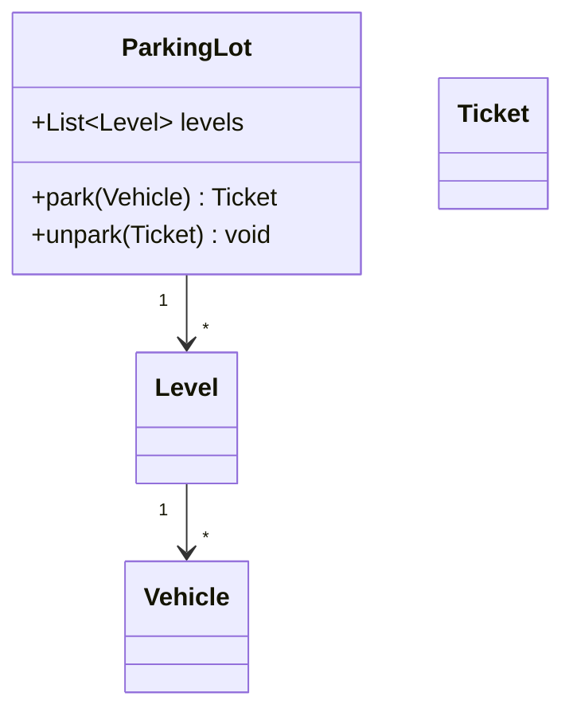

# Low-Level Design Writing — Viết bài thiết kế cấp thấp

**Persona:** Bạn là kỹ sư giỏi thiết kế hướng đối tượng. Bạn viết để người đọc học cách **chia trách nhiệm giữa các class** và chọn đúng pattern — không phải vẽ class diagram cho đẹp rồi thôi.

> **Bắt buộc:** Áp dụng `blog-foundations` trước (code chạy được, trade-off, chân thật). File này lo **dạng bài LLD**. LLD khác System Design: SD lo kiến trúc phân tán ở tầng cao; LLD lo thiết kế class/object trong một service.

## 1. Nguyên tắc cốt lõi

- **Bắt đầu từ yêu cầu và use case**, rồi mới tới class. Không vẽ class trước khi rõ hành vi.
- **Trách nhiệm rõ ràng (SRP):** mỗi class một lý do để thay đổi.
- **Dùng pattern khi nó giải quyết vấn đề thật**, không nhồi pattern để "trông pro".
- **Code minh họa chạy được**, thể hiện quan hệ giữa các class.
- **Nêu trade-off:** vì sao thiết kế này, đánh đổi gì, mở rộng ra sao.

## 2. Cấu trúc chuẩn

1. **Tiêu đề:** "Thiết kế [đối tượng]" — ví dụ "Thiết kế bãi đỗ xe (Parking Lot)".
2. **Yêu cầu & use case:** hệ thống cần làm gì; liệt kê hành vi chính.
3. **Xác định thực thể (entities):** danh từ trong đề → class tiềm năng.
4. **Class diagram:** các class, thuộc tính, phương thức, quan hệ (kế thừa, kết hợp).
5. **Áp dụng design pattern:** pattern nào cho vấn đề nào và vì sao (Strategy, Factory, State, Observer, Singleton...).
6. **Code minh họa:** hiện thực các class chính, thể hiện tương tác.
7. **SOLID & mở rộng:** thiết kế tuân SOLID ở đâu; thêm tính năng mới thì sửa gì.
8. **Trade-offs & lựa chọn khác.**
9. **Key takeaways.**

## 3. Class diagram

Dùng Mermaid class diagram:

````markdown

````

Kèm giải thích quan hệ; alt text cho ảnh tĩnh.

## 4. Design pattern — dùng đúng chỗ

- Nêu **vấn đề trước, pattern sau**: "Cần đổi cách tính phí lúc chạy → dùng Strategy".
- Chỉ dùng pattern khi nó thật sự gỡ được vấn đề (linh hoạt, giảm coupling). Nhồi pattern là anti-pattern.
- Giải thích ngắn pattern cho người chưa quen, nhưng đừng viết lại sách — tập trung vào cách áp vào bài này.
- Tên pattern và ý nghĩa phải chính xác (dễ nhầm Factory vs Abstract Factory, Strategy vs State).

## 5. Code minh họa

- Ngôn ngữ OOP rõ ràng (Java/C#/Python/TypeScript...); nêu rõ.
- Thể hiện **quan hệ và tương tác** giữa class, không chỉ một class lẻ.
- Interface/abstract class để lộ điểm mở rộng.
- Đủ để hiểu thiết kế, lược phần lặp bằng comment. Đã kiểm chứng cú pháp.

## 6. SOLID & khả năng mở rộng

- Chỉ ra thiết kế tuân nguyên tắc SOLID ở đâu (đặc biệt SRP và OCP — mở để mở rộng, đóng để sửa đổi).
- **Bài kiểm tra mở rộng:** nêu một yêu cầu mới (loại xe mới, cách tính phí mới) và cho thấy thiết kế thêm vào dễ hay khó. Đây là phần cho thấy chất lượng thiết kế.

## 7. Checklist

- [ ] Bắt đầu từ yêu cầu & use case, không vẽ class trước.
- [ ] Có class diagram (Mermaid) kèm giải thích quan hệ.
- [ ] Pattern được dùng có lý do rõ (vấn đề → pattern), không nhồi.
- [ ] Tên pattern & ý nghĩa chính xác.
- [ ] Code minh họa chạy được, thể hiện tương tác giữa class.
- [ ] Chỉ ra tuân SOLID; có bài kiểm tra mở rộng.
- [ ] Có trade-off & phương án thay thế.

## 8. Anti-patterns

- Vẽ class diagram trước khi rõ yêu cầu.
- Nhồi design pattern để "trông chuyên nghiệp".
- Dùng sai/nhầm tên pattern.
- God class ôm hết trách nhiệm (vi phạm SRP).
- Code chỉ một class lẻ, không cho thấy quan hệ.
- Bỏ qua khả năng mở rộng — điểm mấu chốt của LLD.
