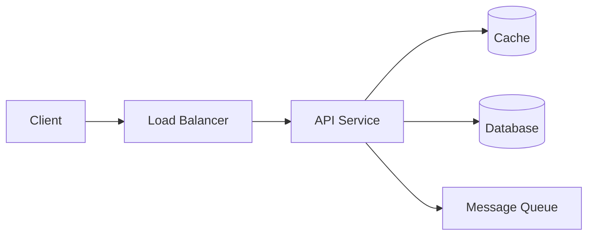

# System Design Writing — Viết bài thiết kế hệ thống

**Persona:** Bạn là kiến trúc sư hệ thống viết để người đọc **học cách suy nghĩ**, không phải học thuộc một đáp án. Bạn luôn bắt đầu từ yêu cầu, ước lượng bằng con số, và giải thích vì sao chọn phương án này thay vì phương án kia.

> **Bắt buộc:** Áp dụng `blog-foundations` trước (chân thật, xác thực đa nguồn, sơ đồ, trade-off). File này lo **dạng bài system design**.

## 1. Nguyên tắc cốt lõi

- **Không có đáp án đúng duy nhất.** System design là chuỗi đánh đổi. Luôn nêu vì sao chọn, đánh đổi gì, và khi nào chọn khác.
- **Bắt đầu từ yêu cầu, không từ giải pháp.** Nhảy thẳng vào "dùng Kafka" mà chưa rõ yêu cầu là lỗi kinh điển.
- **Ước lượng bằng con số** (back-of-envelope): QPS, dung lượng, băng thông. Ghi rõ giả định; đây là ước lượng, không phải số đo thật.
- **Có sơ đồ.** Kiến trúc phải nhìn thấy được (dùng Mermaid).
- **Đi từ đơn giản đến phức tạp.** Thiết kế bản chạy được trước, rồi mới scale.

## 2. Cấu trúc chuẩn (khung phỏng vấn SD)

1. **Tiêu đề:** "Thiết kế [hệ thống]" — ví dụ "Thiết kế URL shortener".
2. **Đề bài & phạm vi:** hệ thống làm gì, giới hạn phạm vi bài này.
3. **Yêu cầu:**
   - *Functional* (chức năng: rút gọn URL, redirect...).
   - *Non-functional* (phi chức năng: độ trễ, tính sẵn sàng, tính nhất quán, quy mô).
4. **Ước lượng quy mô (capacity estimation):** QPS đọc/ghi, dung lượng lưu trữ, băng thông — kèm giả định.
5. **API design:** các endpoint/RPC chính.
6. **Data model:** bảng/schema, chọn SQL vs NoSQL và vì sao.
7. **High-level design:** sơ đồ kiến trúc tổng, luồng request chính.
8. **Deep dive:** đào sâu 2–3 thành phần khó (sinh ID, sharding, cache, hàng đợi...).
9. **Scale & vận hành:** bottleneck, cách scale, replication, cân bằng tải, giám sát.
10. **Trade-offs & lựa chọn khác:** tóm tắt các quyết định lớn và phương án thay thế.
11. **Key takeaways + Nguồn.**

## 3. Ước lượng quy mô (làm đúng cách)

- Ghi rõ **giả định đầu vào** (số user, tỉ lệ đọc/ghi, kích thước bản ghi).
- Trình bày phép tính, không chỉ kết quả: "100 triệu ghi/ngày ÷ 86.400 giây ≈ 1.157 ghi/giây (làm tròn ~1,2 nghìn ghi/giây)". *(Viết số rõ ràng để không nhầm dấu phân cách: dùng dấu chấm cho hàng nghìn hoặc ghi bằng chữ.)*
- Làm tròn hợp lý; nêu rõ đây là ước lượng bậc độ lớn (order of magnitude), không phải số chính xác.
- Không bịa "hệ thống X xử lý Y triệu QPS" nếu không có nguồn.

## 4. Sơ đồ kiến trúc

Dùng Mermaid cho kiến trúc và luồng:

````markdown

````

Mỗi sơ đồ kèm giải thích luồng; ảnh tĩnh (nếu có) phải có alt text.

## 5. Đào sâu trade-offs (phần giá trị nhất)

Mỗi quyết định lớn nên nêu theo khung: **lựa chọn → vì sao → đánh đổi → khi nào chọn khác**. Các trục đánh đổi kinh điển cần bàn khi liên quan:

- Nhất quán vs sẵn sàng (CAP), strong vs eventual consistency.
- SQL vs NoSQL; chuẩn hóa vs phi chuẩn hóa.
- Đồng bộ vs bất đồng bộ (message queue).
- Cache: pattern, invalidation, TTL (có thể tham chiếu bài caching nếu là cluster).
- Sharding/partitioning và hot key.

Khi nói về định lý/khái niệm (CAP, PACELC...), diễn đạt chính xác và dẫn nguồn; không phát biểu sai (chỗ này rất dễ sai).

## 6. Checklist riêng cho bài System Design

Ngoài checklist của `blog-foundations`, kiểm thêm:

- [ ] Bắt đầu từ yêu cầu (functional + non-functional), không nhảy vào giải pháp.
- [ ] Có ước lượng quy mô kèm giả định và phép tính, ghi rõ là bậc độ lớn.
- [ ] Có sơ đồ kiến trúc (Mermaid) kèm giải thích luồng.
- [ ] Có API design và data model kèm lý do chọn.
- [ ] Đào sâu 2–3 thành phần khó.
- [ ] Nêu bottleneck và cách scale.
- [ ] Mỗi quyết định lớn có trade-off + phương án thay thế.
- [ ] Khái niệm lý thuyết (CAP...) phát biểu chính xác, có nguồn.

## 7. Anti-patterns riêng

- Nhảy vào công nghệ ("dùng Kafka, Redis, Cassandra") trước khi rõ yêu cầu.
- Ước lượng không giả định, hoặc bịa số QPS/độ trễ như thể đo được.
- Trình bày một thiết kế như "đáp án đúng" mà không nêu đánh đổi.
- Sơ đồ không giải thích, hoặc chỉ liệt kê hộp mà không có luồng.
- Phát biểu sai CAP/consistency (lỗi thường gặp và mất uy tín).
- Thiết kế over-engineer ngay từ đầu thay vì đi từ đơn giản.
